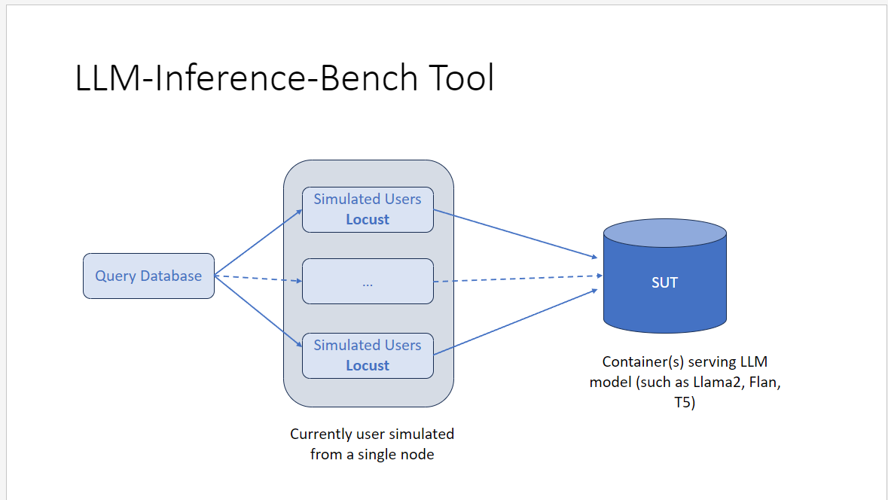
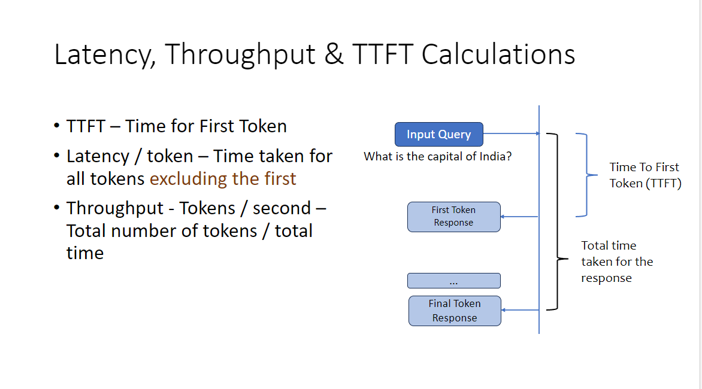

## LLM-Inference-Bench: Benchmarking LLM Inference by Infobellit

## LLM-Inference-Bench Tool

 The objective of the LLM Inference Bench Tool is to identify the Latency of each request made and measured in millisecond/token,Time To First Token (TTFT) and the Throughput measured in number of tokens/second. The above metrics is measured with varying Input Tokens (Query Length), Output Tokens (Response Length) and Simulating Parallel Users.

## Summarizing the main aspects focused on:



The Benchmark tool mainly focusses on data collection ,analyzing the CPU and Memory requirements and load testing with varying number of Users.
## Performance metrics:



The performance metrics captured while running the benchmark includes Latency,TTFT and Throughput for varying input and output tokens and parallel users. 
# Follow the below steps to reproduce similar results

## Setup the Environment

### Create a Virtual Environment
```bash
python3 -m venv myenv
source myenv/bin/activate
```

### Install the Dependencies
* The Inference Benchmark load test relies on [Locust package](https://locust.io/). Install it using pip.

```bash
pip install -r requirements.txt
```

## Dataset Filtering

Here the dataset used is [ShareGPT](https://huggingface.co/datasets/pvduy/sharegpt_alpaca_oa_vicuna_format/viewer/default/train?p=1) Dataset from Hugging Face datasets.

* ShareGPT dataset has been filtered based on varying input token length.
* Different Input Token Lengths considered are 32,64,128,256,512,1k,2k.
* 1000 prompts are filtered out for each token length specified above.

```bash
python3 dataset_filtering.py
```

## Run the Load Test using Locust

* Define the configurations required to run different tests in the ["llm_inference_benchmark.sh"] shell script.
* List of parallel users "(1 3 10 30)".
* Varying Input tokens "(32 64 128 256 512)" and Output tokens "(32 64 128 256 512)".

* Add the required arguments to execute the below command (output_dir to save the results and the generation_endpoint to run the benchmark).
* The generation_endpoint here can be any inference server endpoint,For example TGI Endpoint hosting a model (http://localhost:8080/generate_stream).

```bash
./llm_inference_benchmark.sh <output_dir> <generation_endpoint>
```


## Benchmark Result Analysis

* All the CSV's received are further processed by running llm_result_analysis.py and the throughput, latency, ttft can be analyzed with the help of plots generated.

```bash
python3 llm_result_analysis.py
```

* The above command starts up a streamlit application which displays the generated plots.

Refer [`LLM_Inference_Benchmark_pdf`](Inference-Benchmark-tool-public.pdf) for more detailed usage on how to get the dataset and run the benchmark.
