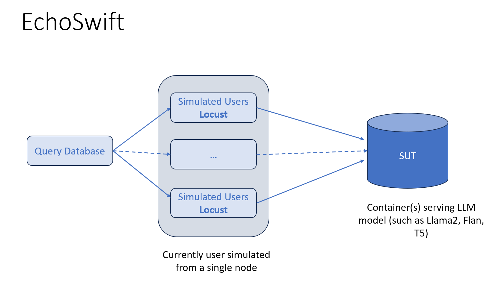
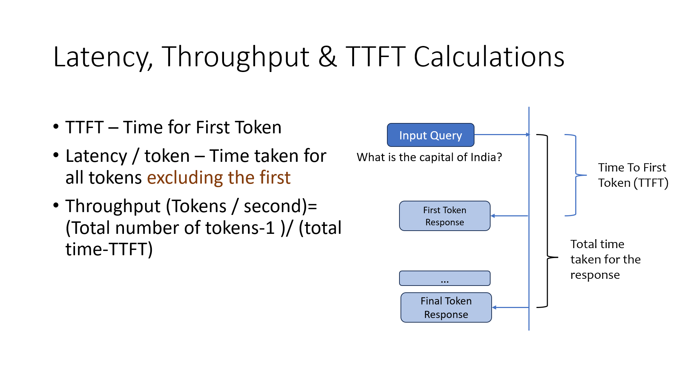

# EchoSwift: LLM Inference Benchmarking Tool by Infobell IT

EchoSwift is a powerful and flexible tool designed for benchmarking Large Language Model (LLM) inference. It allows users to measure and analyze the performance of LLM endpoints across various metrics, including token latency, throughput, and time to first token (TTFT).



## Features

- Benchmark LLM inference across multiple Inference Servers
- Measure key performance metrics: latency, throughput, and TTFT
- Support for varying input and output token lengths
- Simulate concurrent users to test scalability
- Easy-to-use CLI interface
- Detailed logging and progress tracking

## Supported Inference Servers
  - TGI
  - vLLM
  - Ollama
  - Llamacpp
  - NIMS

## Performance metrics:

The performance metrics captured for varying input and output tokens and parallel users while running the benchmark includes 
- Latency (ms/token)
- TTFT(ms)
- Throughput(tokens/sec) 



## Installation

You can install EchoSwift using pip:

```bash
pip install echoswift
```

Alternatively, you can install from source:

```bash
git clone https://github.com/Infobellit-Solutions-Pvt-Ltd/EchoSwift.git
cd EchoSwift
pip install -e .
```

## Usage

EchoSwift provides a simple CLI interface for running LLM Inference benchmarks.

Below are the steps to run a sample test, assuming the generation endpoint is active.

### 1. Download the Dataset and create a default `config.json`

Before running a benchmark, you need to download and filter the dataset:

```bash
echoswift dataprep
```

This command will download the filtered ShareGPT dataset from Huggingface and creates a sample config.json

### 2. Configure the Benchmark

Modify the `config.json` file in the project root directory. Here's an example configuration:

```json
{
  "_comment": "EchoSwift Configuration",
  "out_dir": "test_results",
  "base_url": "http://10.216.178.15:8000/v1/completions",
  "provider": "vLLM",
  "model": "meta-llama/Meta-Llama-3-8B",
  "max_requests": 5,
  "user_counts": [3],
  "input_tokens": [32],
  "output_tokens": [256]
}
```

Adjust these parameters according to your LLM endpoint you're benchmarking.

### 3. Run the Benchmark

To start the benchmark using the configuration from `config.json`:

```bash
echoswift start --config path/to/your/config.json
```

### 4. Plot the Results

```bash
echoswift plot --results-dir path/to/your/results_dir
```
## Output

EchoSwift will create a `results` directory (or the directory specified in `out_dir`) containing:

- CSV files with raw benchmark data
- Averaged results for each combination of users, input tokens, and output tokens
- Log files for each Locust run

## Analyzing Results

After the benchmark completes, you can find CSV files in the output directory. These files contain information about latency, throughput, and TTFT for each test configuration.

## Citation

If you find our resource useful, please cite our paper:

### [EchoSwift: An Inference Benchmarking and Configuration Discovery Tool for Large Language Models (LLMs)](https://dl.acm.org/doi/10.1145/3629527.3652273)

```bibtex
@inproceedings{Krishna2024,
  series = {ICPE '24},
  title = {EchoSwift: An Inference Benchmarking and Configuration Discovery Tool for Large Language Models (LLMs)},
  url = {https://dl.acm.org/doi/10.1145/3629527.3652273},
  DOI = {10.1145/3629527.3652273},
  booktitle = {Companion of the 15th ACM/SPEC International Conference on Performance Engineering},
  publisher = {ACM},
  author = {Krishna, Karthik and Bandili, Ramana},
  year = {2024},
  month = May,
  collection = {ICPE '24}
}
```

## Support

If you encounter any issues or have questions, please [open an issue](https://github.com/yourusername/echoswift/issues) on our GitHub repository.